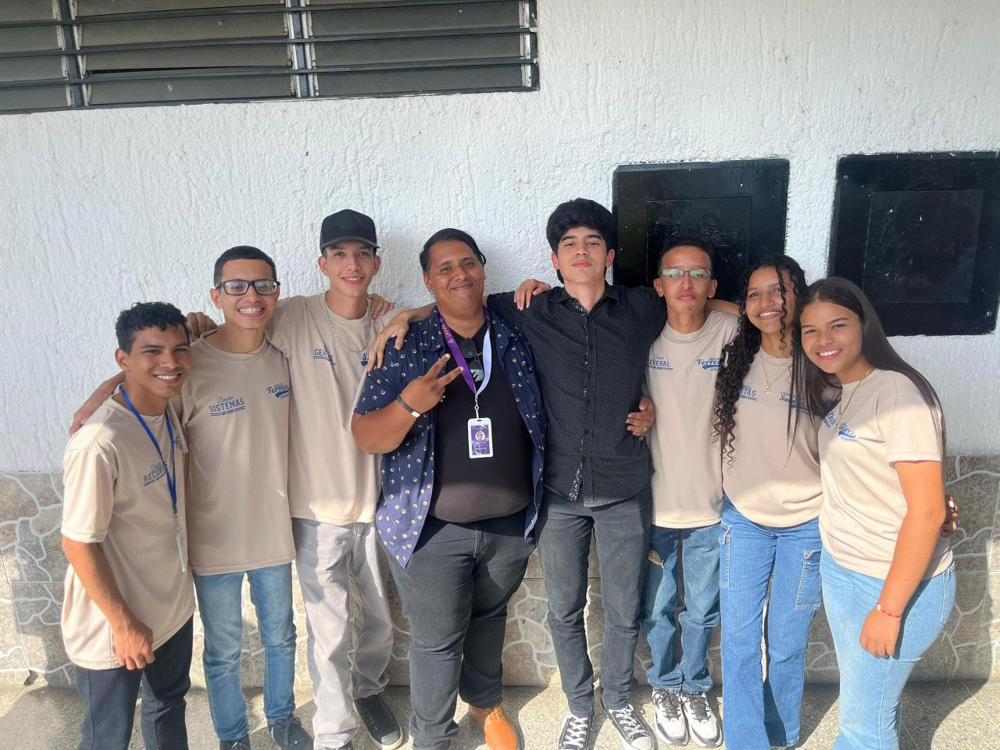

# El origen de las Victimas de Elecentro

## Nace un problema...

En la ciudad de San Juan de Los Morros se encuentra las terribles instalaciones de Elecentro, lo que motivo a una tradición anual que consiste en la quema de las instalaciones de Elecentro, lo que ha hecho que, un grupo importante de personas se interesen en visitar esta ciudad, por la peculiar tradición que se realiza en la ciudad ya mencionada. En medio de este escenario, nace el principal problema: La falta de centros de recreación y hospedaje en San Juan de los Morros. Debido a esto un grupo de visionarios, talentosos e ingeniosos jóvenes se han unido para crear una solución a esta problemática, pero dándole un toque fresco e innovador, es por todo esto que nace el grupo de Las Víctimas de Elecentro, para llevar a cabo y concretar sus ideas.

## Nace una esperanza

Con la creación del grupo Las Víctimas de Elecentro trae consigo la propuesta de la creación del ElecentroLand, pero, ¿Qué es ElecentroLand?, esta nueva compañía, la cual construirán Las Víctimas de Elecentro, será un complejo turístico completo, que no se basará en un sistema de administración arcaico, sino, por el contrario, se plantea la creación de un sistema integral de administración del complejo, que cabe destacar que este está comprendido en: hotel, restaurante, bar, y casino. Se busca conseguir un sistema nuevo, que no haya sido implementado antes en la localidad, cabe resaltar que aunque el complejo surge como una respuesta a la tradición que surgió de San Juan de los morros por la problemática antes mencionada, pues, también se busca colocar a San Juan de Los Morros de vuelta en el mapa, ya que se puede disfrutar de su vasta belleza natural, y con nuestro complejo sería posible, ya que garantizamos una gran experiencia al usuario con confort en su estadía, debido a que pensamos en todo, en su alimentación, los hospedajes y el entretenimiento.
